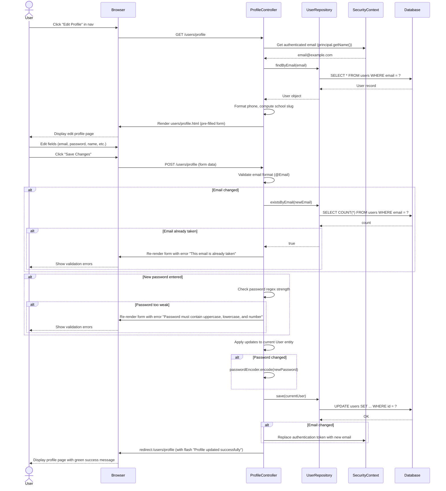
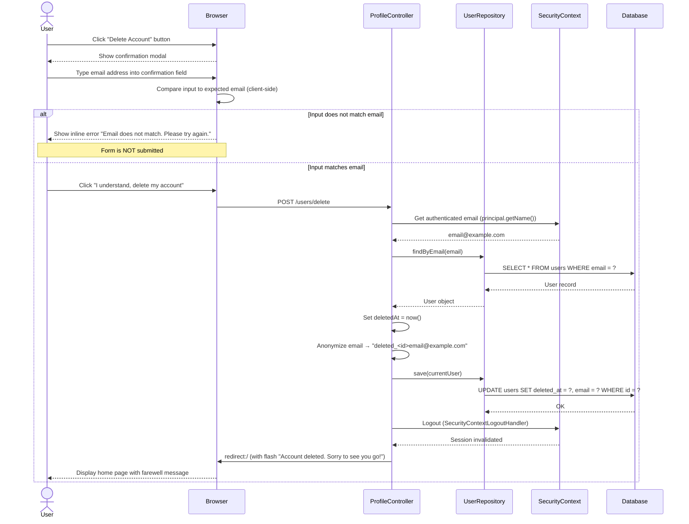

# Sequence Diagram: Manage User Profile

This diagram covers two scenarios: **editing profile information** and **deleting the account**.

> Rendered automatically on GitHub. To export as PNG, paste the Mermaid code into [mermaid.live](https://mermaid.live).

---

## Edit Profile

---

## Delete Account

