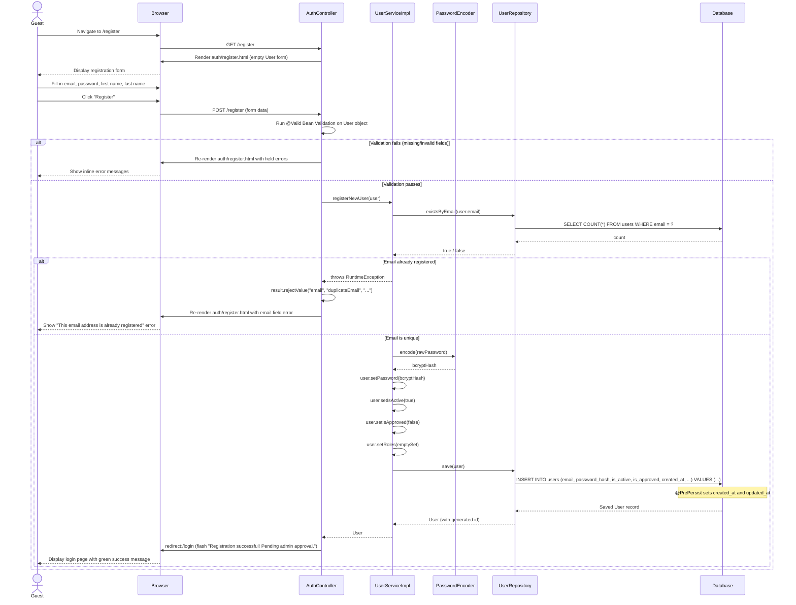

# Sequence Diagram: Register a New User with a Default Role

This diagram covers the staff registration flow (`POST /register`) including validation, password hashing, and persistence.

> Rendered automatically on GitHub. To export as PNG, paste the Mermaid code into [mermaid.live](https://mermaid.live).

---

